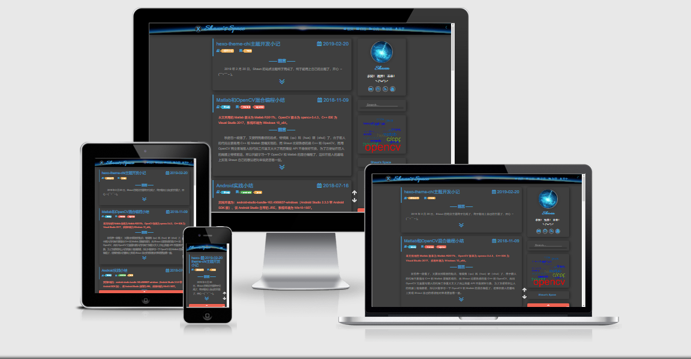

　　Chi 主题涉及到的技术主要为：Bootstrap4、jQuery3、Stylus、EJS、HTML5、CSS3、ES6等；运行环境为：node-v8.11.1、Hexo-3（hexo-cli-1.1.0）等；测试浏览器为Firefox 60.5.0 esr 和 Chrome 72.0.3626.109，其它浏览器没测过，也不考虑测，有兴趣的童鞋可以自己测自己改。

　　Chi 主题的配色主要参考 Shaun 原来的主题 spfk_x，排版部分参考了 [**hexo-theme-freemind**](https://github.com/wzpan/hexo-theme-freemind)，部分代码也是来自这两个主题。Chi 主题的一些动画实现优先采用 CSS，除了那些无法用 CSS 实现或 Shaun 不知道如何用 CSS 实现的，所以 JS 代码部分不算很多，网页加载速度也勉强能够接受吧。

　　Chi 主题的代码高亮部分本来想参考 [为hexo博客加入prettify高亮插件](http://jumpbyte.cn/2016/07/02/use-and-install-prettify/) 使用 prettify 替换默认的代码高亮，但使用了之后发现效果不是很好，就还是使用默认的样式了。

　　Chi 主题的使用文档暂时就不写了，毕竟这个主题只是 Shaun 个人使用（应该也不会有其他人使用了，万一真有人要用却不太会用，欢迎提 issue，以后酌情考虑添加使用文档 🙃），由于 Shaun 只是前端小白，这个主题也只是当学习练手开发，里面肯定会有各种各样的问题，欢迎提 issue 或 fork 或 clone 后自行修改，提 issue 的话，Shaun 不保证一定能解决，毕竟水平有限，当然如果有代码优化想法还望不吝赐教 (｡･ω･｡)ﾉ♡ （至于 px 换 em 或 rem 就不用提了，没什么原因，主要是 Shaun 懒，更深层的原因在于 Shaun 手头上还没有更高分辨率的显示器，不知道显示差距有多大，不好进行测试 😓）。

**PS：** Shaun 使用了 [Hexo 博客美化代码块| 梦魇小栈](https://blog.ihoey.com/posts/Hexo/2018-05-27-hexo-code-block.html) 中的脚本对 Markdown 代码部分进行了美化渲染，但是该脚本有时候渲染会出现一些问题，无法进行美化，可能是代码语法格式有错误，这时*需要自己手动调整一下 Markdown 代码格式*。

使用 Chi 主题推荐安装插件：

- hexo-renderer-pandoc	# 使用pandoc渲染markdown，安装前需卸载默认渲染器hexo-renderer-marked
- hexo-generator-feed # RSS订阅
- hexo-generator-searchdb # 本地搜索
- hexo-abbrlink # 文章唯一永久链接
- hexo-all-minifier # 快速压缩优化代码

好了，暂时就写到这里了。